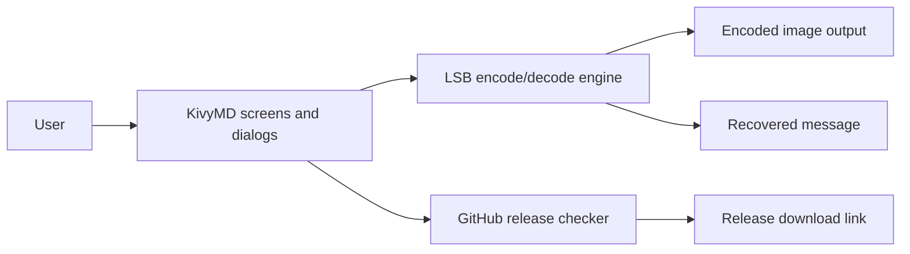

# Architecture and Maintenance Guide

## Purpose

This document describes the structure, runtime flow, and maintenance expectations for the Android version of the Stegnography application.

The goal is to keep the UI layer, encode/decode backend, and update logic separated so the app remains easy to extend and safe to ship.

## System Overview

The app is split into three practical layers:

1. UI layer: KivyMD screens and dialogs in `main.py`, `home.kv`, `encode.kv`, and `decode.kv`.
2. Processing layer: least-significant-bit image encoding and decoding in `least_significant_bit.py`.
3. Update layer: GitHub release detection and link handling in `update.py`.

## Runtime Flow

### Encode path

1. The user chooses a source image.
2. The user optionally chooses a custom save location.
3. The user enters a message and password.
4. The UI validates the inputs.
5. `EncodeMessage.encode_message_()` writes the message bits into the image.
6. The encoded image is saved and the final path is shown to the user.

### Decode path

1. The user chooses an encoded image.
2. The user enters the password.
3. `EncodeMessage.decode_message()` reconstructs the hidden bit stream.
4. The UI shows the decoded message or a friendly error message.

### Update path

1. `main.py` starts a background thread after launch.
2. `update.py` checks the configured GitHub repository for a newer release.
3. If a release exists, the UI shows a dialog with a direct download button.

## File Responsibilities

### `main.py`

Owns application startup, screen switching, file selection, Android permission handling, dialogs, and user-facing error handling.

Important responsibilities:

- Loads the KV files into a screen manager
- Opens file pickers for source and output selection
- Requests Android permissions when needed
- Bridges UI actions to the backend encoder/decoder
- Shows update prompts and general dialogs

### `least_significant_bit.py`

Contains the image steganography engine.

Important responsibilities:

- Validates supported image modes
- Encodes text into RGB/RGBA images
- Decodes text from the least significant bits of an image
- Raises Python exceptions when inputs are invalid
- Saves encoded files to either a custom path or the default output folder

### `update.py`

Contains release-check logic and update metadata handling.

Important responsibilities:

- Contacts GitHub releases
- Determines whether a newer release exists
- Returns metadata used by the UI dialog
- Keeps update logic separate from the UI layer

### KV files

- `home.kv` controls the home screen and navigation drawer.
- `encode.kv` controls the image hiding workflow.
- `decode.kv` controls the extraction workflow.

### `buildozer.spec`

Controls Android packaging settings, dependencies, permissions, API targets, icon, and orientation.

## Design Principles

### Keep the backend pure

The encode/decode engine should not know about dialogs, notifications, or file picker widgets. It should accept inputs, process data, and return a path or a decoded string.

### Keep the UI responsible for user experience

Dialogs, validation messages, storage selection, and screen transitions belong in the UI layer.

### Prefer explicit failures

The backend should raise clear exceptions such as:

- file not found
- unsupported image mode
- password missing
- insufficient image capacity
- incorrect password during decode

The UI should convert these into readable, user-friendly messages.

### Avoid Android-only imports at module top level unless guarded

The current codebase already guards Android-specific modules with try/except. Keep that pattern so desktop testing remains possible.

## Storage Strategy

### Android

- Default output path: `/internal storage/android/encoded images/data`
- Custom user-selected output paths are supported
- If the user selects a new source image, the previous custom save path is cleared so the next encode uses an explicit destination choice

### Windows and Linux

- Default output path: the user's `Pictures` folder
- The folder is created automatically if it does not exist
- Custom save selection should always override the default

## Permission Strategy

The app currently requests:

- `INTERNET`
- `READ_MEDIA_IMAGES` on Android 13+
- `READ_EXTERNAL_STORAGE` on older Android versions

This is sufficient for image selection and update checking in the current feature set.

## Packaging Notes

### Dependencies

The current packaging list includes Kivy, KivyMD, Pillow, NumPy, Plyer, and Pyjnius.

The KivyMD dependency should remain pinned to a known release instead of a moving branch.

### API level

- `android.api = 34` is appropriate for current Android requirements.
- `android.minapi = 21` keeps the app compatible with older devices while still supporting modern permission behavior.

### Private storage

`android.private_storage = True` is recommended because it avoids broad external-storage access and keeps app files isolated.

## Maintenance Checklist

Use this checklist before shipping a new build or release.

### UI checks

- Verify all KivyMD widgets still exist in the installed version.
- Check that the drawer title, toolbar, and action icons are visible on dark backgrounds.
- Confirm dialogs open and dismiss correctly.
- Test the save-path picker and image picker flows.

### Backend checks

- Validate encode/decode with small and medium test images.
- Confirm the app rejects unsupported image modes.
- Confirm password validation still works.
- Check that output files are written to the expected folder.

### Android checks

- Confirm image permissions appear on first launch.
- Confirm Android 13+ image selection works.
- Confirm the app can write encoded images to the chosen path.
- Confirm update dialogs open the release page or download link.

### Release checks

- Pin dependency versions in `buildozer.spec`.
- Build a debug APK and test on a device or emulator.
- Verify no legacy KivyMD API warnings are left unresolved.
- Make sure icon assets and labels are still readable.

## Common Failure Modes

### Unknown class or property errors

Cause: a KV file is using a widget or property removed in KivyMD 2.0.

Fix: replace the legacy widget with the current KivyMD equivalent and re-run the app.

### Dialog argument errors

Cause: using old `MDDialog(title=..., text=..., buttons=...)` patterns against the modern dialog API.

Fix: use `MDDialogHeadlineText`, `MDDialogSupportingText`, and `MDDialogButtonContainer`.

### Save path confusion

Cause: a custom save path was chosen previously and is being reused.

Fix: the current implementation clears the custom save path when the user selects a new source image.

### Android permission failures

Cause: the runtime did not grant the requested media permission.

Fix: re-test the permission prompt and confirm the app is built for the correct API level.

## Recommended Future Improvements

1. Add a small visible label on the encode screen showing the currently selected save folder.
2. Add a dedicated tests folder with small encode/decode regression cases.
3. Pin all Python dependencies to exact or release-tag versions.
4. Add a release checklist script for repeatable builds.
5. Add checksum or signature verification to any future auto-update download flow.

## Ownership Notes

- Keep UI changes in KV files or `main.py`.
- Keep algorithmic changes inside `least_significant_bit.py`.
- Keep release-check changes in `update.py`.
- Keep Android packaging changes in `buildozer.spec`.

Following that boundary keeps the project maintainable and reduces accidental regressions.